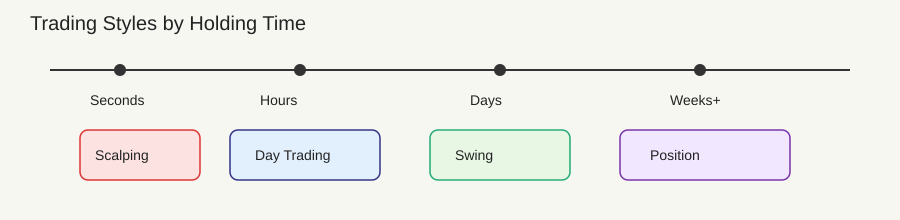
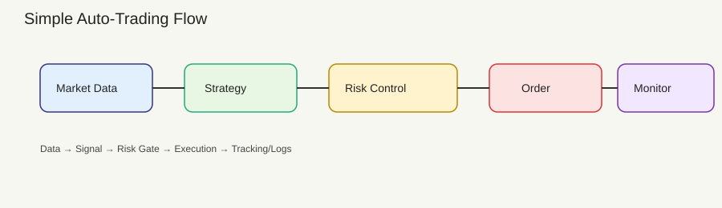

---
title: "트레이딩 입문"
date: "2026-02-05"
category: "금융"
tags:
    - 트레이딩
    - 투자
    - 전략
summary: "트레이딩의 기본 개념과 용어를 실제로 어떻게 활용하는지까지 초보자 관점에서 쉽게 정리했습니다."
---

# 트레이딩 입문

이 글은 트레이딩이 처음인 분들을 위한 개념 정리입니다.
투자 조언이 아니며, 용어가 실제로 어떻게 쓰이는지 이해하는 데 목적이 있습니다.

---

## 1) 트레이딩 스타일 한눈에 보기
"얼마나 오래 보유하느냐" 기준으로 나누면 아래처럼 정리됩니다.

### 스캘핑(Scalping)
- 보유 기간: 수초~수분
- 목표: 아주 작은 움직임을 여러 번 반복
- 특징: 빠른 판단, 수수료/슬리피지 영향 큼
- 활용: 변동성이 순간적으로 커질 때 짧게 진입하고 빠르게 청산

### 데이 트레이딩(Day Trading)
- 보유 기간: 하루 이내 (당일 청산)
- 목표: 하루 변동성 안에서 수익 추구
- 특징: 장중 흐름과 뉴스 영향을 많이 받음
- 활용: 장중 추세나 돌파가 나올 때 당일 흐름만 먹고 종료

### 스윙 트레이딩(Swing Trading)
- 보유 기간: 며칠~수주
- 목표: 중간 규모의 추세(스윙) 포착
- 특징: 기술적 분석 중심, 비교적 여유 있는 매매
- 활용: 추세 방향만 맞추고 중간 파동을 타는 방식

### 포지션 트레이딩(Position Trading)
- 보유 기간: 수주~수개월
- 목표: 큰 추세를 길게 가져감
- 특징: 거시 흐름/펀더멘털 참고
- 활용: 큰 방향성에 베팅하고 중간 변동은 견디는 방식

---

## 2) 전략 유형과 활용법

### 추세 추종(Trend Following)
- 생각: "오르는 건 더 오르고, 내리는 건 더 내린다"
- 활용: 추세가 확인되면 따라타고, 꺾이면 나옴
- 유리한 환경: 강한 방향성이 있을 때

### 평균 회귀(Mean Reversion)
- 생각: "가격은 평균으로 되돌아간다"
- 활용: 과도한 급등/급락 뒤 반대 포지션으로 짧게 대응
- 유리한 환경: 변동은 있지만 큰 방향이 없을 때

### 돌파 매매(Breakout)
- 생각: 중요 가격대를 넘으면 흐름이 이어질 수 있음
- 활용: 저항 돌파 시 진입, 돌파 실패 시 빠르게 정리
- 유리한 환경: 변동성이 커지며 새 흐름이 시작될 때

### 박스권(범위) 매매(Range Trading)
- 생각: 일정 구간에서 위아래 반복된다
- 활용: 상단에서 매도, 하단에서 매수, 범위 이탈 시 손절
- 유리한 환경: 횡보 구간이 길게 유지될 때

### 차익거래(Arbitrage)
- 생각: 거래소 간 가격 차이를 이용해 위험을 줄인 수익
- 활용: 가격 차이가 클 때 동시에 매수/매도
- 유리한 환경: 거래소 간 가격 괴리가 자주 발생할 때

### 마켓 메이킹(Market Making)
- 생각: 호가를 양쪽에 내고 스프레드를 수익으로 가져감
- 활용: 매수/매도 호가를 좁게 내고 체결을 반복
- 유리한 환경: 거래량이 충분하고 스프레드가 안정적일 때

---

## 3) 자주 쓰는 지표
지표는 과거 가격을 계산한 결과라서 후행일 수 있습니다.
그래서 "지표 하나로 결정하지 않는다"는 원칙이 중요합니다.

### 추세 관련
- 이동평균선(MA): 가격의 평균 흐름
- 활용: 가격이 평균선 위면 상승 기조, 아래면 하락 기조로 해석
- EMA(지수이동평균): 최근 가격에 가중치
- 활용: 단기 추세 변화를 더 빠르게 파악
- MACD: 이동평균 간 거리로 추세/전환 신호 파악
- 활용: 추세 지속 여부나 약화 신호 확인
- ADX: 추세의 강도 표시
- 활용: 추세가 "약한지/강한지" 판단에 사용

### 모멘텀/과매수·과매도
- RSI: 과열/침체 구간 판단
- 활용: 과열 시 추세 둔화 가능성, 침체 시 반등 가능성 체크
- Stochastic: 가격의 상대 위치로 과열 판단
- 활용: 짧은 구간의 반전 타이밍 보조 지표로 사용

### 변동성
- Bollinger Bands: 평균 대비 변동성 범위
- 활용: 밴드 밖 이탈은 과열/급변 신호로 해석
- ATR: 변동성 크기 측정
- 활용: 손절 폭이나 목표폭을 "현재 변동성" 기준으로 설정

### 거래량
- OBV: 가격 움직임에 거래량을 결합
- 활용: 가격 상승과 거래량이 함께 증가하는지 확인
- VWAP: 거래량가중평균, 평균 매입단가 기준선
- 활용: 기관 평균 단가 기준선으로 매수/매도 힘 비교

### 기타
- Ichimoku: 추세/지지저항을 한 번에 보는 지표
- 활용: 지지/저항 영역을 구조적으로 파악
- Fibonacci 되돌림: 되돌림 비율 참고선
- 활용: 되돌림 구간에서의 반등/재하락 가능성 체크

---

## 4) 리스크 관리 규칙

### 핵심 개념
- 손절(Stop Loss): 큰 손실을 막는 안전장치
- 익절(Take Profit): 수익 확정 구간
- 포지션 사이징: 한 번에 얼마나 베팅할지
- 손익비(Risk/Reward): 손실 대비 기대 이익 비율

### 어떻게 써먹나
- 손절: 차트 구조가 깨지는 지점에 둠
- 익절: 최소 손익비가 맞는 지점에 둠
- 포지션 사이징: "한 번의 손실이 전체 자금의 1~2% 이내" 같은 규칙을 사용
- 변동성 기준: ATR을 이용해 손절 폭을 시장 상황에 맞춤

### 아주 쉬운 숫자 예시
- 자금 100만 원, 한 번의 손실을 1%로 제한
- 허용 손실 1만 원
- 손절 폭이 500원이라면, 매수 수량은 20주
- 손절 폭이 1,000원이라면, 매수 수량은 10주

---

## 5) 초보자에게 적용하기 쉬운 조합

### 스윙 + 추세추종
- 방법: 20일 이동평균 위면 매수, 아래면 매도
- 포인트: 큰 흐름만 따라가고 잦은 매매를 줄임

### 박스권 + 평균 회귀
- 방법: 박스 하단 근처 매수, 상단 근처 매도
- 포인트: 박스 이탈 시 빠른 손절 필수

---

## 6) 처음 시작할 때 추천되는 공부 순서
1. "스윙 트레이딩 + 추세추종"을 먼저 이해
2. 이동평균선, RSI, MACD 개념 익히기
3. 손절/익절과 포지션 사이징을 규칙으로 고정
4. 그 다음에 스캘핑이나 복잡한 전략으로 확장

---

## 7) 용어 미니 사전
- 캔들: 일정 시간의 가격 움직임(시가/고가/저가/종가)
- 지지선/저항선: 가격이 자주 멈추는 구간
- 슬리피지: 주문 가격과 실제 체결 가격의 차이
- 시장가 주문에서 슬리피지가 커질 수 있음
