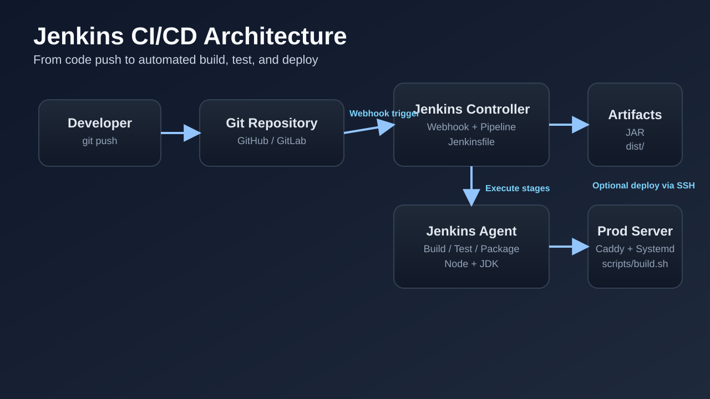
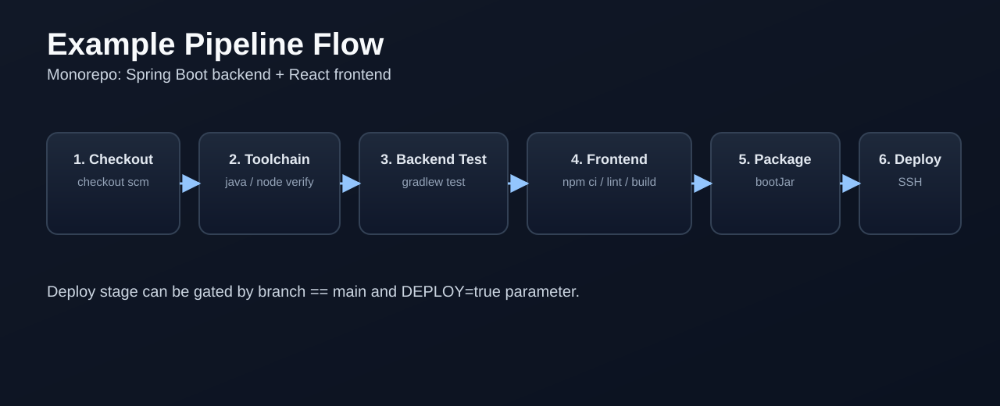

# Jenkins 개념부터 실무 적용까지

팀 프로젝트가 커지면 이런 문제가 자주 생깁니다.

- 누가 어떤 순서로 빌드했는지 알기 어렵다
- 로컬에서는 되는데 서버에서는 실패한다
- 배포 절차가 사람마다 달라진다

Jenkins는 이 과정을 **코드로 고정**해서 자동화하는 도구입니다.



## 1. Jenkins란?

Jenkins는 CI/CD 오케스트레이션 서버입니다.

- CI(Continuous Integration): 코드가 들어오면 자동으로 빌드/테스트
- CD(Continuous Delivery/Deployment): 조건이 맞으면 자동 배포

핵심은 "사람이 하던 반복 작업"을 Pipeline으로 고정한다는 점입니다.

## 2. 자주 쓰는 핵심 용어

- `Controller`: 파이프라인을 관리하는 본체
- `Agent`: 실제 빌드/테스트가 실행되는 노드
- `Pipeline`: 자동화 흐름 전체
- `Stage`: 파이프라인의 단계(Checkout, Test, Build, Deploy 등)
- `Jenkinsfile`: 파이프라인 정의 파일
- `Credentials`: SSH 키, 토큰, 비밀번호 같은 비밀 정보 저장소
- `Multibranch Pipeline`: 브랜치별 Jenkinsfile 자동 인식

## 3. Jenkins를 쓰는 이유

### 3-1. 재현 가능한 빌드

로컬 환경 차이를 줄일 수 있습니다.

### 3-2. 빠른 피드백

코드 푸시 후 테스트 실패를 바로 확인할 수 있습니다.

### 3-3. 배포 안정성

배포 조건(브랜치, 승인, 파라미터)을 명확하게 관리할 수 있습니다.

## 4. 파이프라인 예시 흐름

아래는 백엔드(Spring Boot) + 프론트엔드(Vite) 모노레포에서 자주 쓰는 흐름입니다.



- 1) Checkout
- 2) Toolchain 확인(Java/Node)
- 3) Backend test
- 4) Frontend lint/build
- 5) Backend package(JAR)
- 6) 배포(조건부)

## 5. Jenkins 웹 UI에서 실제로 하는 설정

### 5-1. 플러그인 설치

- Pipeline
- Git
- Credentials Binding
- SSH Agent
- NodeJS
- JUnit
- ANSI Color

### 5-2. Tool 등록

`Manage Jenkins -> Tools`

- JDK 17
- Node.js 22

### 5-3. Credentials 등록

`Manage Jenkins -> Credentials`

- 배포용 SSH 키 (`SSH Username with private key`)
- 필요 시 Git 접근 토큰

### 5-4. Job 생성

`New Item -> Multibranch Pipeline`

- Repository 연결
- Script Path: `Jenkinsfile`

## 6. Jenkinsfile 기본 예시

```groovy
stage('Backend Test') {
  steps {
    sh '''
      cd apps/backend
      ./gradlew --no-daemon clean test
    '''
  }
}

stage('Frontend Lint & Build') {
  steps {
    sh '''
      cd apps/frontend
      npm ci
      npm run lint
      npm run build
    '''
  }
}
```

이렇게 프로젝트 기준 명령을 명시하면 누가 빌드해도 절차가 동일합니다.

## 7. 배포 파라미터 설계 팁

배포 단계를 바로 열어두면 위험합니다. 보통 아래처럼 제어합니다.

- 브랜치: `main`에서만 배포
- 파라미터: `DEPLOY=true`일 때만 배포
- 대상 서버: `DEPLOY_HOST`, `DEPLOY_USER`, `DEPLOY_DIR`로 분리

예시 전략:

- PR/feature 브랜치: CI만 수행
- main 브랜치: CI + 조건부 CD

## 8. 실패를 줄이는 운영 팁

- 빌드 스크립트는 저장소에 둔다 (`scripts/build.sh`)
- 민감정보는 Jenkins Credentials로만 관리
- 파이프라인 실행 시간 제한(`timeout`) 설정
- 동시 배포 방지(`disableConcurrentBuilds`) 사용
- 테스트 결과/JAR/정적 빌드 결과물을 아카이브

## 9. 트러블슈팅 체크리스트

- Node 버전 오류: Jenkins Tool의 Node 버전 확인
- Gradle 실패: Java 버전(JDK 17) 확인
- SSH 배포 실패: Credential ID와 공개키 등록 상태 확인
- 배포 중 sudo 대기: 서버 `sudoers` 정책 점검(NOPASSWD)

## 10. 마무리

Jenkins의 핵심은 "자동화 도구" 자체보다도,

- 빌드/테스트/배포 절차를 코드로 표준화하고
- 실패 지점을 빨리 드러내고
- 배포를 안전하게 제어하는 것

입니다.

처음에는 CI만 붙이고,
그 다음에 조건부 배포(CD)로 확장하는 방식이 가장 안정적입니다.
